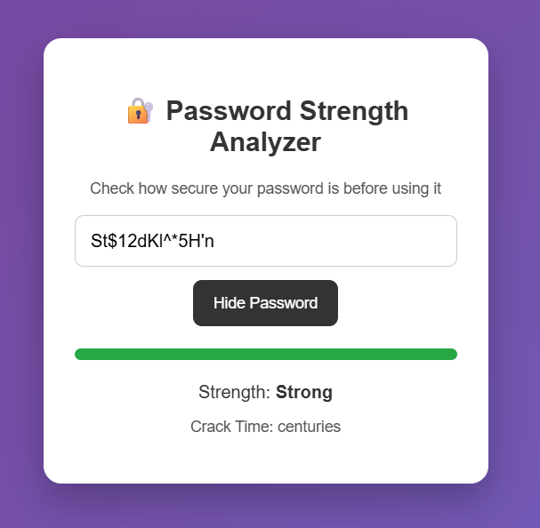
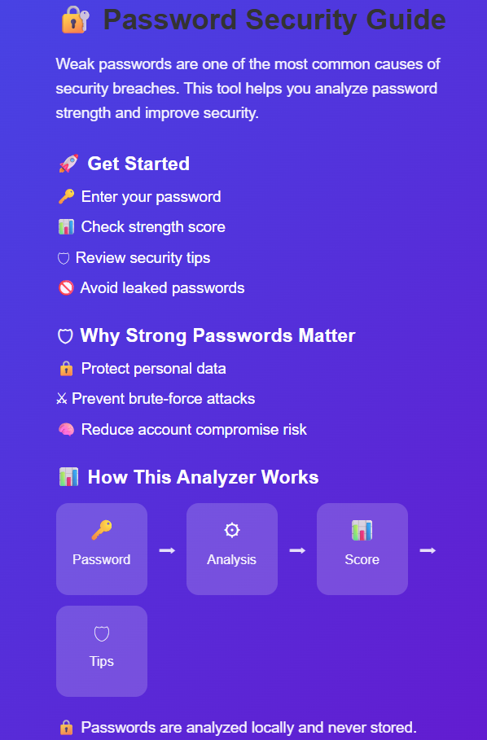

# 🔐 Password Strength Analyzer

A modern web-based password security tool built using **React.js** that helps users analyze password strength, estimate crack time, detect leaked passwords, and improve password security.

---

## 🚀 Features

- Password strength scoring using **zxcvbn**
- Visual strength meter (Very Weak → Strong)
- Crack-time estimation
- Security warnings and improvement suggestions
- Leaked password detection using a local dataset
- Show / Hide password functionality
- Responsive and user-friendly UI
- Informational security guide with icons and infographic
- Privacy-first design (passwords are never stored)

---

## 🛠 Tech Stack

- **Frontend:** React.js
- **Library:** zxcvbn
- **Styling:** CSS (Flexbox, Responsive Design)

---

## 📸 Screenshots

### Overall Project View


### Password Strength Analyzer


### Security Guide & Infographic


---

## ⚙️ Installation & Run

```bash
git clone https://github.com/your-username/password-strength-analyzer.git
cd password-strength-analyzer
npm install
npm start
